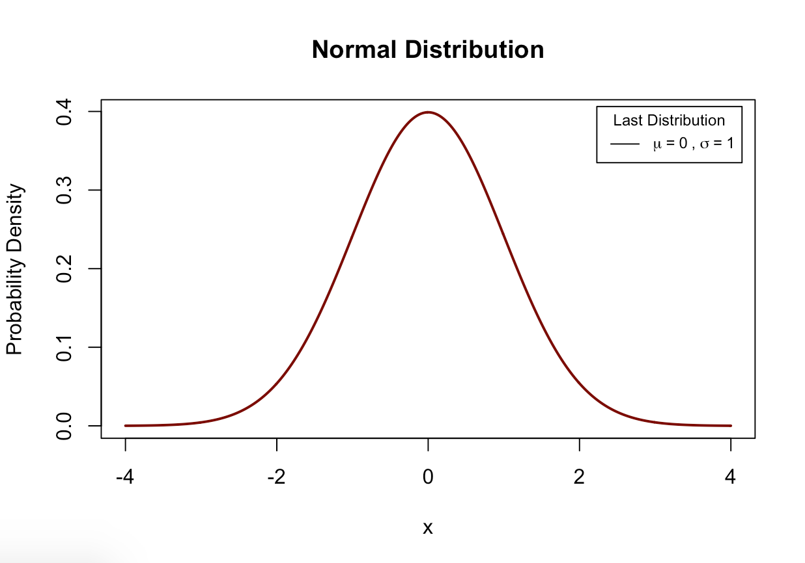

# pdplot

This package contains a single function, `pd_plot`, which visualizes probability density/mass functions provided in the base `R`. The available probability density/mass functions include the following: `normal`, `logistic`, `binomial`, `chi-square`, `poisson`, `exponential`, `cauchy`, `beta`, `gamma`, and `geometric`. 

## Installation

``` r
install.packages(devtools)
devtools::install_github("tegedik/pdplot")
```

## Usage

`pd_plot` follows the convention of density distributions in `R`. First you need to create a vector of quantiles or pass it as the first argument in the function. Then, you need to select the correct parameter(s) for each distribution. Finally, you need to enter the `type` of the distribution. Here is an example with normal distribution.

``` r
pd_plot(seq(-4, 4, 0.01), mean=0, sd=1, type="normal")
```



This will create a normal probability distribution with `mean` 0 and `sd` 1. After calling this function, you can also overlay other density curves using `lines` argument. For example,

``` r
pd_plot(seq(-4, 4, 0.01), mean=0, sd=1, type="normal")
pd_plot(seq(-4, 4, 0.01), mean=0, sd=2, type="normal", lines=TRUE)
```

Here is an example with binomial distribution,

``` r
pd_plot(0:40, size=20, prob=0.4, type="binomial")
pd_plot(0:40, size=20, prob=0.6, type="binomial", lines=TRUE)
```

Again, you need to pick the right arguments for the parameter values: in this case, `size` and `prob`.
Although the code is not very efficient and scalable at this point, you can use with `apply` family functions or `purrr:map`.

``` r
pd_plot(0:40, lambda=6, type="poisson")
rep_func <- function(rep){pd_plot(0:40, lambda=rep, type="poisson", lines=TRUE)}
rep <- 7:10
lapply(rep, rep_func)
```


